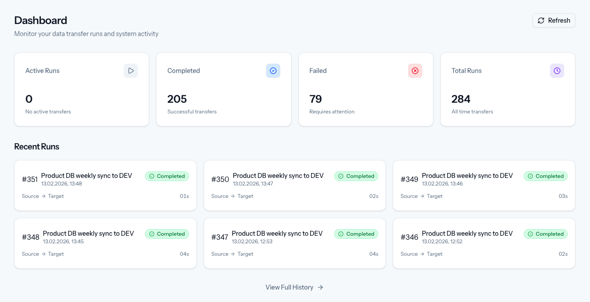
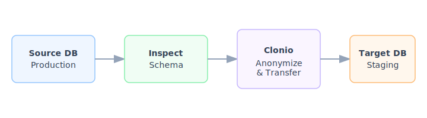

# Introduction

Clonio is a database cloning tool that creates safe, anonymized copies of production databases for development, testing, and staging environments. It provides a web-based interface for configuring connections, defining anonymization rules, scheduling cloning runs, and monitoring execution in real time. For data protection auditors there is a signed audit log to prove the transferred data settings and log entries.

## The Problem

Development teams need production-like data to build and test effectively, but production databases contain personally identifiable information (PII) that cannot be used outside of production. Manually copying and sanitizing data is error-prone, time-consuming, and difficult to audit.

Regulations like the GDPR require that personal data is handled with care. A single oversight - an unmasked email address, a real phone number in a test environment - can lead to compliance violations and fines.

## What Clonio Does

Clonio sits between your production database and your non-production environments. It reads from the source, applies transformation rules you define, and writes the anonymized data to the target.

> [!WARNING]
> You are responsible to define the anonymizing function for the fields that contain such data.

**Core capabilities:**

- **Multi-database support** — Connects to MySQL, MariaDB, PostgreSQL, and SQL Server as both source and target. Cross-database cloning (e.g., MySQL to PostgreSQL) is supported.
- **Data anonymization** — Replace sensitive columns with fake data (names, emails, phone numbers), hash values, mask content, or set to null. Transformations are configured per column, per table.
- **Row selection** — Copy full tables, only the first X rows, or only the last X rows. Useful for reducing dataset size in test environments while keeping recent data.
- **Foreign key awareness** — When a parent table uses row selection, child tables are automatically filtered to preserve referential integrity.
- **Schema replication** — Clonio reads the source schema and ensures the target schema matches before transferring data. New columns or tables are created automatically.
- **Scheduling and triggers** — Run clonings manually, on a cron schedule, or via an API trigger URL that integrates with CI/CD pipelines.
- **Webhook notifications** — Get notified via HTTP webhooks when a cloning run succeeds or fails.
- **Audit trail** — Every cloning run generates a cryptographically signed audit report documenting the configuration, execution log, and GDPR compliance status. Audit reports can be printed or shared via public links.
- **Real-time execution console** — Monitor cloning progress live with a timestamped log showing each step as it happens.

## How It Works

A typical workflow follows these steps:

1. **Configure connections** — Add your source (production) and target (test/staging) database connections.
2. **Create a cloning** — Use the step-by-step wizard to name the cloning, select source and target, configure table transformations, set a schedule, and define triggers.
3. **Run the cloning** — Execute manually, wait for the schedule, or trigger via API. Clonio replicates the schema, transfers data in chunks, applies anonymization rules, and maintains foreign key integrity.
4. **Monitor and audit** — Watch progress in real time. After completion, review the audit trail report for compliance documentation.

## Next Steps

Head to the [Installation](02-installation.md) guide to set up Clonio and run your first clone.
