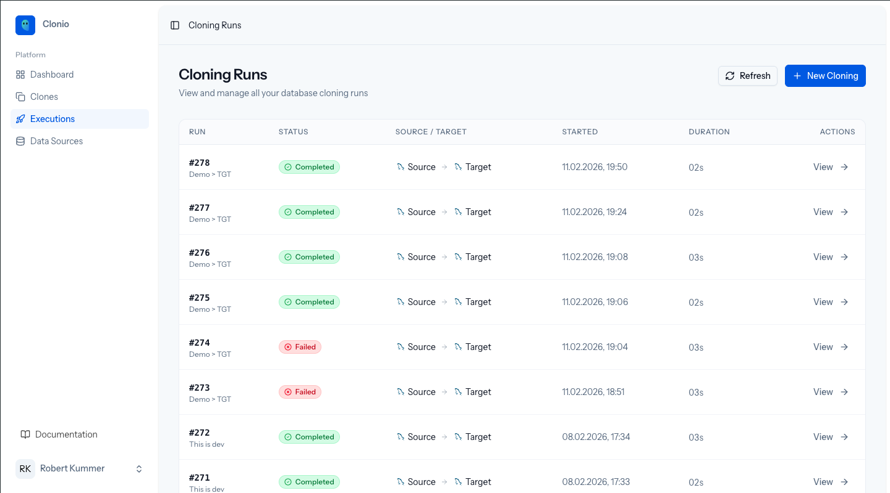
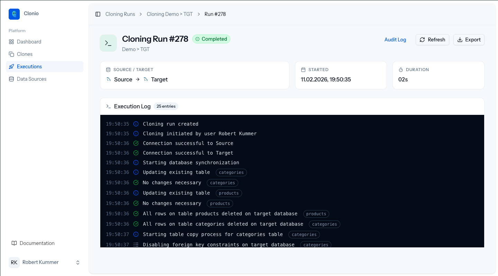

# Execution

A cloning run is a single execution of a cloning configuration. It reads data from the source, replicates the schema on the target, transfers records with anonymization applied, and logs every step along the way.

## Cloning Runs List

Navigate to **Executions** in the sidebar to see all cloning runs across all configurations.



The table displays:

| Column | Description |
|--------|-------------|
| **Run** | Run number and the cloning configuration name |
| **Status** | Completed (green), Failed (red), or Running (blue) |
| **Source / Target** | The connection names used for this run |
| **Started** | Date and time the run began |
| **Duration** | How long the run took to complete |
| **Actions** | View button to open the run detail page |

Runs are sorted by most recent first. Use the **Refresh** button to update the list.

## Run Detail Page

Click **View** on any run to see its full execution log.



The header shows:

- **Run number** and status badge
- **Cloning name** the run belongs to
- **Source / Target** connection names
- **Started** timestamp
- **Duration** of the execution

Available actions:

- **Audit Log** -- Open the cryptographically signed audit trail report
- **Refresh** -- Reload the log entries
- **Export** -- Download the complete run data as JSON

## Execution Log

The execution log is a real-time, timestamped record of every step in the cloning process. During an active run, new entries appear automatically.

A typical run progresses through these phases:

### 1. Initialization

```
Cloning run created
Cloning initiated by user Robert Kummer
```

The run record is created and the initiator (user, schedule, or API) is logged.

### 2. Connection Testing

```
Connection successful to Source
Connection successful to Target
```

Clonio verifies both database connections before proceeding. If either connection fails, the run is marked as failed immediately.

### 3. Schema Synchronization

```
Starting database synchronization
Updating existing table  categories
No changes necessary  categories
Updating existing table  products
No changes necessary  products
```

Clonio inspects the source schema and ensures the target schema matches. Tables are created or updated as needed. If no schema changes are required, "No changes necessary" is logged.

### 4. Table Emptying

```
All rows on table products deleted on target database
All rows on table categories deleted on target database
```

Before copying data, existing rows on the target are deleted. Tables are emptied in reverse dependency order to respect foreign key constraints.

### 5. Data Transfer

```
Starting table copy process for categories table
Disabling foreign key constraints on target database  categories
Starting chunked data copy of 3 rows (chunk size: 1000)
Transferred 3 / 3 rows
Data copy completed. Total rows: 3, Failed chunks: 0
Enabling foreign key constraints on target database  categories
```

For each table, Clonio:

1. Disables foreign key constraints on the target
2. Determines the transfer order based on primary key columns
3. Reads data from the source in chunks (default: 1,000 rows per chunk)
4. Applies configured anonymization transformations
5. Writes the transformed data to the target
6. Re-enables foreign key constraints

Tables are processed in topological order based on their foreign key dependencies, ensuring parent tables are populated before child tables.

### 6. Progress Reporting

During data transfer, progress is reported with:

- Rows processed / total rows
- Transfer speed (rows per second)
- Estimated time remaining

For large tables, progress updates appear periodically rather than after every chunk.

## Handling Failures

If a run fails, the execution log shows exactly where it stopped and the error message. Common failure causes:

- **Connection timeout** -- Source or target database is unreachable
- **Permission denied** -- Database user lacks required privileges
- **Schema mismatch** -- A column type incompatibility that cannot be resolved automatically
- **Foreign key violation** -- Data integrity issue during transfer

Failed runs do not affect the target database's previous state if the failure occurs before data transfer begins. If failure occurs during transfer, the target may contain partial data from the current run.

## Exporting Run Data

Click **Export** to download the complete run data as a JSON file. The export includes:

- Run metadata (ID, cloning name, status, timestamps)
- Source and target connection details (credentials are excluded)
- The complete execution log with all entries

This is useful for sharing run details with team members or for programmatic analysis.

## Next Steps

Learn about the [Audit Log](02-audit-log.md) to understand the compliance reporting for each run.
