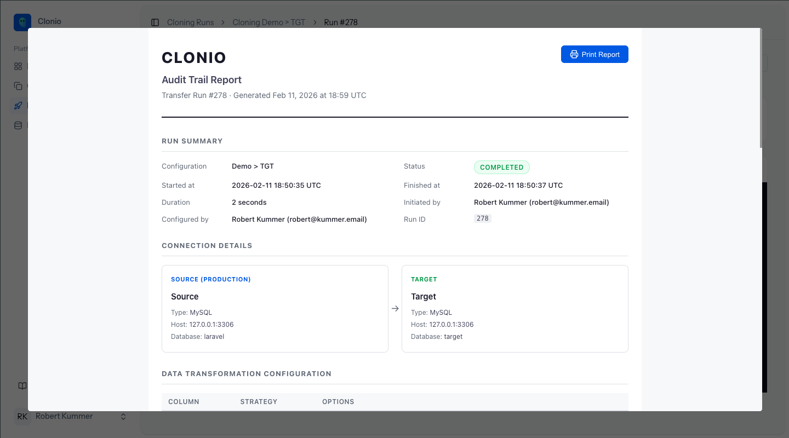
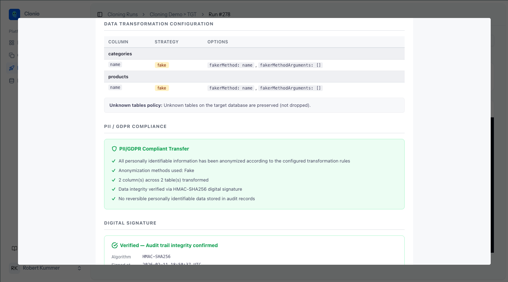
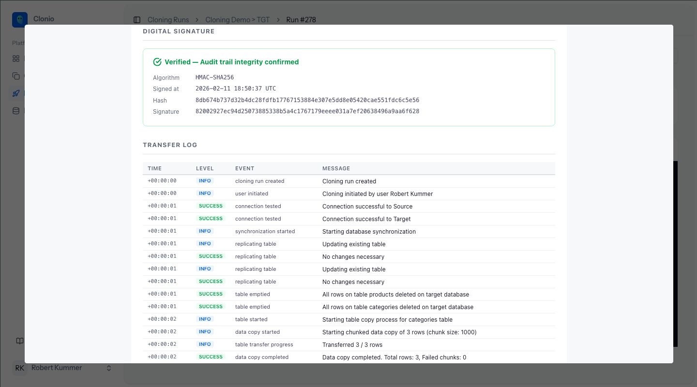
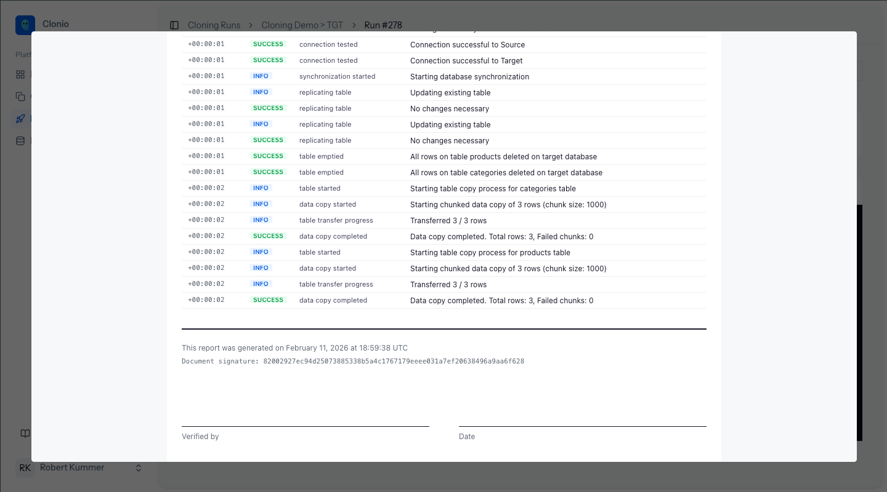

# Audit Log

Every cloning run generates an audit trail report that documents the complete execution for compliance purposes. The report is cryptographically signed to ensure its integrity cannot be tampered with after generation.

## Accessing the Audit Log

From any cloning run detail page, click the **Audit Log** link in the header to open the report.

## Report Contents

The audit trail report is a structured document with the following sections:

### Run Summary

The summary captures key facts about the execution:

| Field | Description |
|-------|-------------|
| **Configuration** | The cloning configuration name |
| **Status** | Completed or Failed |
| **Started at** | UTC timestamp when the run began |
| **Finished at** | UTC timestamp when the run ended |
| **Duration** | Total execution time |
| **Initiated by** | The user, schedule, or API trigger that started the run |
| **Configured by** | The user who created or last modified the cloning configuration |
| **Run ID** | Unique identifier for this execution |

### Connection Details

Shows the source and target database connection information:

- Connection name
- Database type (MySQL, PostgreSQL, etc.)
- Host and port
- Database name

Credentials (passwords, usernames) are never included in the audit report.

### Data Transformation Configuration

A table listing every column transformation applied during the run:

| Column | Information |
|--------|------------|
| **Table name** | The table containing the transformed column |
| **Column** | The column name |
| **Strategy** | The transformation type (fake, hash, mask, null) |
| **Options** | Strategy-specific details (e.g., faker method and arguments) |

The **Unknown tables policy** is also documented, indicating whether unknown tables on the target were preserved or dropped.

### PII / GDPR Compliance

A compliance summary confirms:

- All personally identifiable information has been anonymized according to the configured transformation rules
- The anonymization methods used (e.g., Fake, Hash)
- The number of columns and tables transformed
- Data integrity verified via HMAC-SHA256 digital signature
- No reversible personally identifiable data stored in audit records

This section provides clear documentation for data protection audits.

### Digital Signature

The audit report is signed using HMAC-SHA256. The signature section includes:

| Field | Description |
|-------|-------------|
| **Algorithm** | HMAC-SHA256 |
| **Signed at** | UTC timestamp when the signature was generated |
| **Hash** | SHA-256 hash of the report content |
| **Signature** | The HMAC-SHA256 signature value |

The signature verifies that the report has not been altered since it was generated. Any modification to the report content would invalidate the signature.

### Transfer Log

The complete execution log is embedded in the report, showing every event with:

- **Time** -- Relative timestamp from the start of the run
- **Level** -- INFO, SUCCESS, or DEBUG
- **Event** -- The event type (e.g., `connection_tested`, `data_copy_started`)
- **Message** -- Human-readable description of what happened

### Document Footer

The report footer includes:

- Generation timestamp
- Document signature for verification
- Signature fields for "Verified by" and "Date" (for printed copies)

## Printing

Click the **Print Report** button at the top of the audit report to generate a printer-friendly version. The printed report includes all sections and is suitable for physical archiving or compliance reviews.

## Use Cases

### GDPR Compliance Audits

The audit trail provides documented proof that:

1. Personal data was anonymized during the transfer
2. Specific anonymization methods were applied to identified PII columns
3. The report has not been tampered with (verified by digital signature)
4. The responsible person and timestamp are recorded

### Internal Data Governance

Teams can use audit reports to:

- Track who initiated each data transfer and when
- Verify that transformation rules are consistently applied
- Maintain a history of all database cloning operations
- Demonstrate due diligence in data handling processes

### Incident Investigation

If a data issue is discovered in a non-production environment, the audit log for the relevant cloning run shows exactly what transformations were applied and whether any columns were missed.

## Next Steps

Learn about [Profile and Security](/docs/4-settings/01-profile-and-security) settings to manage your account.
